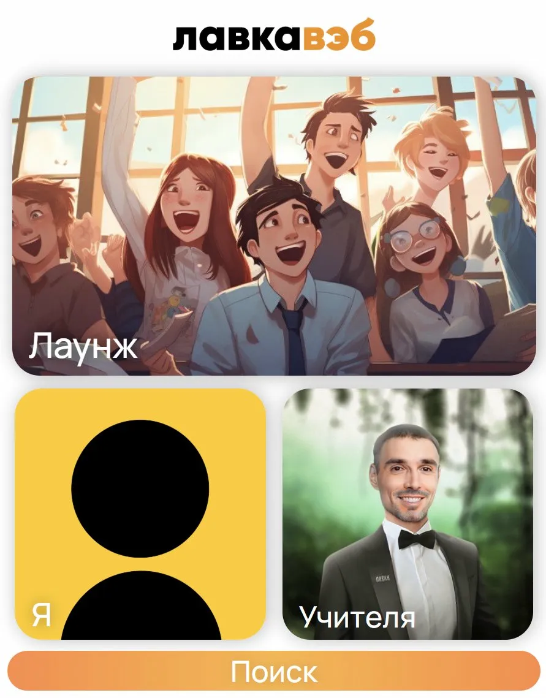
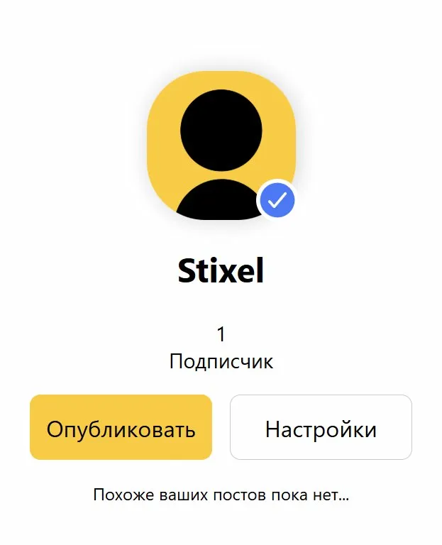
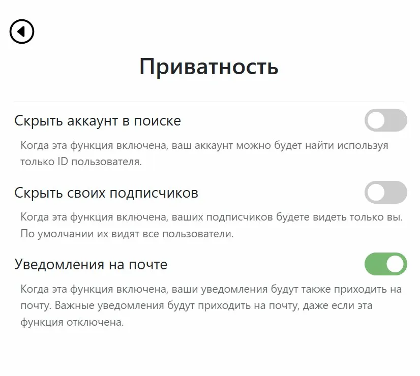

# ЛавкаВэб — Social Network

> A full-featured social network built from scratch with pure PHP and MySQL.



---

## 📋 About the Project

**LavkaWeb** is a social network web application developed as a solo project. It supports user accounts, posts, subscriptions, communities, notifications, and privacy settings — a complete social platform built without any frameworks or external libraries.

**Tech stack:** PHP (no framework) · MySQL 8.4.3 · HTML · CSS · JavaScript · Laragon (local server)

---

## ✨ Features

### 👤 User Accounts
- Registration and login with email confirmation
- Avatar upload and profile name customization
- Subscription system (follow users and communities)
- Subscriber count with hide/show option

### 📝 Posts & Feed
- Create posts with images
- General feed (all posts from subscriptions)
- Like and comment on posts
- Pin posts to the top of a profile
- Profile page with all user's posts

### 🏘️ Communities
- Create and join communities
- Community administration with multiple admin roles
- Community posts and subscriber management

### 🔔 Notifications
- In-app notification system
- Email notifications (can be toggled in settings)

### 🔒 Privacy Settings
- Hide your account from search (findable only by user ID)
- Hide your subscriber list from other users
- Toggle email notifications

### 🔍 Search
- Search users by name
- Search communities by name

### 📐 Grade Calculator
- Built-in tool for calculating academic grades

---

## 🚀 Installation & Setup

### Requirements

- [Laragon](https://laragon.org/download/) (recommended) or any local server with PHP + MySQL support (XAMPP, WAMP, etc.)
- MySQL 8.0+
- PHP 7.4+

---

### Step 1 — Clone the Repository

```bash
git clone https://github.com/YOUR_USERNAME/lavkaweb.git
```

Or download the ZIP and extract it into your Laragon `www` folder:

```
C:\laragon\www\lavkaweb\
```

---

### Step 2 — Import the Database

1. Start Laragon and make sure MySQL is running.
2. Open **HeidiSQL** (comes bundled with Laragon) or go to `http://localhost/phpmyadmin`.
3. Create a new database named `register-bd` (or import will create it automatically).
4. Import the SQL dump file:
   - In HeidiSQL: `File → Load SQL file → LavkawebSQL.sql → Run`
   - In phpMyAdmin: `Import → Choose file → LavkawebSQL.sql → Go`

This will create all required tables: `users`, `posts`, `comments`, `likes`, `subscribers`, `communities`, `notifications`, `admin_rights`, `user_rights`.

---

### Step 3 — Configure Database Connection

Find the file where the database connection is set up (typically something like `db.php` or `connect.php`) and make sure the credentials match your local setup:

```php
$host = "127.0.0.1";
$dbname = "register-bd";
$user = "root";      // default Laragon username
$password = "";      // default Laragon password (empty)
```

> **Laragon defaults:** host `127.0.0.1`, user `root`, password — empty. If you changed these, update accordingly.

---

### Step 4 — Launch the Project

1. Start Laragon (click **Start All**).
2. Open your browser and go to:

```
http://localhost/lavkaweb/
```

3. Register a new account and confirm via email (or check your local mail catcher).

---

## 📸 Screenshots

| Main Screen | Profile Page | Privacy Settings |
|---|---|---|
|  |  |  |

---

## 🗄️ Database Schema Overview

| Table | Description |
|---|---|
| `users` | User accounts, credentials, privacy settings |
| `posts` | Posts with image support, likes count, pin flag |
| `comments` | Comments linked to posts and users |
| `likes` | Many-to-many: users ↔ posts |
| `subscribers` | Subscription relationships between users |
| `communities` | Community profiles with owner and subscriber info |
| `notifications` | In-app notifications with seen/unseen status |
| `admin_rights` | Global admin roles |
| `user_rights` | Per-community admin/moderator rights |

---

## 📁 Project Structure

```
lavkaweb/
├── index.php           # Entry point / main feed
├── profile.php         # User profile page
├── post.php            # Single post view
├── settings.php        # Account settings
├── search.php          # User and community search
├── community.php       # Community page
├── ...                 # Other pages
├── images/             # Uploaded user images and avatars
│   └── defaultuserimage.jpg
└── LavkawebSQL.sql     # Database dump
```

> **Note:** The exact file structure may vary. This is a general overview.

---

## ⚠️ Known Limitations

- Passwords are stored without hashing (this was a learning project — not recommended for production).
- No `.env` file or config abstraction — DB credentials are set directly in the connection file.
- Email confirmation requires a configured local mail server (e.g. Laragon's built-in fake SMTP or Mailtrap).

---

## 👨‍💻 Author

**Mikhail Savkin** — first-year student at МГТУ im. Bauman, Innovative Entrepreneurship.  
Built this as a solo project to learn web development end-to-end.

- GitHub: [@YOUR_USERNAME](https://github.com/YOUR_USERNAME)
- Telegram: [@YOUR_TG](https://t.me/YOUR_TG)

---

## 📄 License

This project is for portfolio and educational purposes.
